# Fisher's Iris Data Set Analysis

# Contents
[1. Introduction](#introduction)

[1.1 How to use this GitHub Repository](#how-to-use-this-github-repository)

[1.2 What is Fisher's Iris Data Set?](#what-is-fishers-iris-data-set)

[1.3 Why is this data set used?](#why-is-this-data-set-used)

[1.4 Any controversies regarding this data set?](#any-controversies-regarding-this-data-set)

[2. Creation of the Program](#creation-of-the-program)

[2.1 Libraries Used in this Program](#libraries-used-in-this-program)

[2.2 Plots Used in this Program](#plots-used-in-this-program)

[2.3 References and Resources](#references-and-resources)

[3. Analysis - Findings](#analysis-findings)

[3.1 Plots and Summary Statistics](#plots-and-summary-statistics)

[3.2 Summary and Conclusions](#summary-and-conclusions)

[4.0 External Research conducted by Others](#external-research-conducted-by-others)

[4.1 External Conclusions and Alignment with Mine](#external-conclusions-and-alignment-with-mine)

# Introduction

This repo contains the famous Fisher's Iris Data set (iris_csv.csv), a program that will create a number of plots (the .png files) alongside summary statistics (analysis.txt), and the aforementioned files created by the program.

## How to use this GitHub Repository

This GitHub repository contains Brian Doheny's project for the Programming and Scripting module for 2020. 

The root folder contains the following files and folders
* iris_csv.csv - A CSV file containing Fisher's Iris data set. This file contains 5 columns containg the sepal length, sepal width, petal length, petal width and type for 150 Iris flowers.
* irisAnalysis.py - A Python program that loads iris_csv.csv into a dataframe, and performs numerous plots. You can find tehse plots in the "plots" folder.
* analysis.txt - A text file containing summary statistics from iris_csv.csv. Here you'll find the mean, median, minimum, maximum and standard deviation for each of the four measurements in the CSV file.
* LICENSE - An MIT license for this Github Repository.
* README.md - You are currently reading this file.
* plots/ - This folder and subsequent folders contains all of the png created by irisAnalysis.py. Each type of plot has its own subfolder based on its type - histograms (plots/histograms/), scatter plots (plots/scatterplots/), heatmaps (plots/heatmaps/) and cat, box and violin plots (/plots/boxViolinCat/)
* Planning/ - This folder contains my notes and plans for this project, along with the specifications for the project as outlined in the project document shared with us. I've also included a timeline for my own use, although COVID-19 related disruptions meant the original timeline could not be met.

You can download this GitHub repository to your local device and run the program by following these steps:
1. On the righthand side of this repository, you'll find the "Clone or download" button. Click this, then copy the HTTPS URL (this can be done by clicking the clipboard icon).

2. In your command line interface (e.g. Terminal on a Mac), navigate to the directoy where you'd like to download the repository to.
3. While in the desired directory, type "git clone [paste the URL here]"
4. Hit enter and the repository will be downloaded into that directory.
5. You can then run the irisAnalysis.py program by typing "python irisAnalysis.py" while in the directory that contains the irisAnalysis.py program. (Note: You will need to have Python 3.7 installed, along with matplotlib, pandas, seaborn and numpy. All of these are available in the [Anaconda package available here](https://www.anaconda.com/products/individual))

## What is Fisher's Iris Data Set?

Fisher's Iris Data Set is a set of data that contains the measurements of the sepeal length, sepal width, petal length and petal width of three types of Iris flower - Iris Setosa, Iris Virginica and Iris Versicolor. Although this data set was made famous by Ronald Fisher's paper "The use of multiple measurements in taxonomic problems", it was actually gathered by Edgar Anderson. The data set contains the aforementioned measurements for 150 Iris flowers, with 50 in each of the 3 Iris categories.

## Why is this data set used?

This data set is often used to introduce students to multivariate data analysis, as well as for machine learning studies, as it is a relatively small data set at 150 observations, while still being just large enough for skills building. Meanwhile the limited number of variants (i.e. the four measurements on each flower) alongside the small set of categories (i.e. the three types of Iris flower measured) allow students to practice various plotting techniques with real data. Finally, Ronald Fisher himself was a well respected statistician and his impact on the field of statistics is still felt today.

## Any controversies regarding this data set?

While studying this data set, it became apparently that there is some mild controversy in the field of botany regarding the defintion of sepals and petals in the case of Iris flowers ([as can be seen here](https://www.researchgate.net/publication/237010807_What_should_we_know_about_the_famous_Iris_data)). That said, this particular controversy does not spill over into the field of statistics, data analysis or machine learning, and so doesn't impact this particular project. 

# Creation of the program

## Libraries Used in this Program

For this project, I have used the following Python Libraries:

* Pandas - Pandas is a library made specifically for creating and manipulating data frames in Python. These two dimensional data structures (i.e. they have rows as well as columns) allow data scientists to select and manipulate the data to their equirements. This allows for easier plotting, whether that be Panda's own plotting functionality, or via other libraries. In this project, Pandas has been used to create the iris_csv.csv file, and then structure the dataframe so that I could make the desired plots.
* Matplotlib.pyplot - Matplotlib is the most popular library for creating plots in Python, and in fact numerous other libraries for plotting are based off the functionality of Matplotlib. In this project I have used matplotlib.pyplot to create histograms and scatter plots for the various measurements in the data set.
* Seaborn - Seaborn is another popular library for creating plots in Python, and is based on the functionality introduced by Matplotlib. Seaborn introduces a few new plot types, as well as some more aesthetically pleasing default settings for those plots. In this project I've used Seaborn for Cat Plots, Box Plots, Violin Plots and a Pair Plot.

## Plots Used in this Program

### Histograms 
Histograms are used to show the frequency with which observations fall within specified ranges ("bins"). In the case of this data set, bins were specified at ever 0.25cm, and the number of measurements (the observations) that fell within a given range is counted. For example how many Petal Lengths are between 1.75 and 2 cm.

Initially I plotted the entire dataset into histograms, thus displaying the combined data for all three Iris types. I was then able to plot each Iris type onto its own separate histogram for each measurement, thus allowing us to see how the ranges of measurements in each Iris type differs. I have included the initial histograms in this program so as to highlight this evolution.

These Histograms are created by utilising a FOR loop, which will iterate through each of the four columns and plot them to a histogram. These were created with matplotlib, the documentation for which can be [found here](https://matplotlib.org/3.2.1/api/_as_gen/matplotlib.pyplot.hist.html).

### Scatter Plot 
Scatter Plots help to show relationships between two variables when plotted against each other. For example when Petal Length is plotted against Petal Width. 

I was able to create a method of plotting each of the measurements against each other through the use While loop which would iterate through each column and perform a Scatter function that I had previously defined. Initially, the Scatter function plotted the data for all three Iris types together, with no way to differentiate which measumrent comes from which. 

This was improved upon with the Scatter2 function, which required slicing the full dataset into three smaller versions for each flower, and plotting on the same figure. I have left the initiall Scatter function in the program so as to highlight this evolution.

These Scatter Plots were created with matplotlib, the documention for which can be [found here](https://matplotlib.org/3.2.1/api/_as_gen/matplotlib.pyplot.scatter.html).

### Pair Plot
A Pair Plot is actually a series of plots on one figure, whereby each variable is plotted against each other on Scatter Plots, alongside with Histrograms of the individual variables. 

Although the Pair Plot effectivelly does the work of all of my Histograms and Scatter Plots, I left them in so as to show that I wasn't fully reliant on Seaborn's Pairplot for this work. The documentation for Seaborn's pairplot can be [found here](https://seaborn.pydata.org/generated/seaborn.pairplot.html)

### Box Plot
A box plot allows us to see how measurements across various categories compare. The plot itself consists of a box with two "whiskers" either side of it. The limit of the top whisker shows the maximum measurement, while the limit of the bottom whisker shows the minimum measurement. Meanwhile the top edge of the box shows the 75th percentile, the bottom edge shows the 25 percentile, and the line intersecting the box shows the median. This means that in one simple illustration we can see the maximum, minimum, and the three quartile measurements in between.

For this data set I plotted each Iris type against each of the four variables - Sepal Length, Sepal Width, Petal Length and Petal Widt.

These box plots are created by utilising a FOR loop, which will iterate through each of the four columns and plot them to a box plot. Seaborn was used to create these box plots, the documentation for which can be [found here](https://seaborn.pydata.org/generated/seaborn.boxplot.html).

### Violin Plot
Violin Plots are similar to Box Plots in that they allow us to compare multiple categories against a variable. One key difference is that the width of the "violin" illustrates where the concentration of measurements fall in the range, with wider areas showing higher concentrations.

For this data set I plotted each Iris type against each of the four measurements, just like with the Box Plots. My program also utilises a similar FOR loop to create the plots as is used for the box plots. Seaborn was used to create these violin plots, the documentation for which can be [found here](https://seaborn.pydata.org/generated/seaborn.violinplot.html).

### Cat Plot
Cat Plots share similarities with Box Plots and Violin Plots in that they show different categories against a certain variable. The key difference here is that the information is shown as points on the plot, so each of the inidivudal measurements can be seen. 

The Catplots in this program involve the same categories and variables as the Box Plots and Violint Plots, and utilises a similar FOR loop to create the plots. Seaborn was used to create these cat plots, the documentaion for which can be [found here](https://seaborn.pydata.org/generated/seaborn.catplot.html).

### Heat Maps
Heat Maps highlight whether two variables have a correlation (i.e. that one measurement influences the other). In the case of the heat maps created by my program, the paler the colour of the box, the more of a correlation there is, and thus the greater likelihood that the two variables influence each other. 

For my heatmaps, I used Pearson's Correlation Coefficient ([you can find out about this here](https://www.spss-tutorials.com/pearson-correlation-coefficient/)) and so a coefficient close to 1 means that the two variables are positively related (i.e. as one increases, so does the other), whereas a coefficient closer to -1 would mean the two varaibles are negatively related (i.e. as one increase the other decreases). A coefficient closer to 0 suggests no correlation, and thus the two varialbes are not related.

My program produces a heatmap for each of the three Iris types, with the heatmap showing the correlation coefficients for each variable against each other. Seaborn was used to create these heat maps, the documentation for which can be [found here](https://seaborn.pydata.org/generated/seaborn.heatmap.html).

### Analysis.txt
Along with the PNG files containing each of my plots, my program also creates the "analysis.txt" file. This file contains summary statistics for each of the four variables, as well as the Pearson's Correlation Coefficient matrix for each of the three Iris Types.

The summary statisics provided for each of the variables are the mean, median, minimum, maximum and standard deviation.

## References and Resources

### Official Documentation
For this project, I made ample use of the various libraries' documentation, as linked above on each of the various plots. 

### DataCamp
In order to support the content covered in this module, I've also been conducting a lot of study on Datacamp.com. Data Camp is an online learning platform specifically aimed at Data Analysts and Data Scientists, and covers a wide range of subjects involve SQL, Python and R. It is therefore through many of the following courses that I learned how to apply various plots, slices and loops in my code:
* [Introduction to Data Science in Python](https://learn.datacamp.com/courses/introduction-to-data-science-in-python)
* [Intermediate Python](https://learn.datacamp.com/courses/intermediate-python)
* [Python Data Science Toolbox Part 1](https://learn.datacamp.com/courses/python-data-science-toolbox-part-1)
* [Introduction to Importing Data in Python](https://learn.datacamp.com/courses/introduction-to-importing-data-in-python)
* [Intermediate Importing Data in Python](https://learn.datacamp.com/courses/intermediate-importing-data-in-python)
* [Cleaning Data in Python](https://learn.datacamp.com/courses/cleaning-data-in-python)
* [Pandas Foundations](https://learn.datacamp.com/courses/pandas-foundations)
* [Manipulating Dataframes in Pandas](https://learn.datacamp.com/courses/manipulating-dataframes-with-pandas)
* [Introduction to Data Visualization in Python](https://learn.datacamp.com/courses/introduction-to-data-visualization-in-python)

### StackOverflow
While writing this program, I occassionaly encounted unexpected errors and such. While my first attempt was always the official documentation, I did sometimes encounter workarounds from StackOverflow. Where such a workaround has been implemented, I have linked the StackOverflow thread in a comment.

### GeekForGeeks
Alongside official documentation, I have also used guides from [GeekforGeeks Python articles](https://www.geeksforgeeks.org/python-programming-language/?ref=leftbar) to see more examples of implementations, as well as how customisation options (such as alpha) influence the plots.

### Exploratory Data Analysis of IRIS Data Set Using Python

This article, [available here on Medium](https://medium.com/@avulurivenkatasaireddy/exploratory-data-analysis-of-iris-data-set-using-python-823e54110d2d), was found while I was researching other people's analysis on this data set, and it did spur me on to try plots that I was otherwise unaware of, specifically the box plots and violin plots. This article also opened my eyes to the possibility of slicing the dataframe into different Iris types in order to differentiate the colours of scatter plots.

# Analysis - Findings

## Plots and Summary Statistics

### Histograms & Summary Statistics

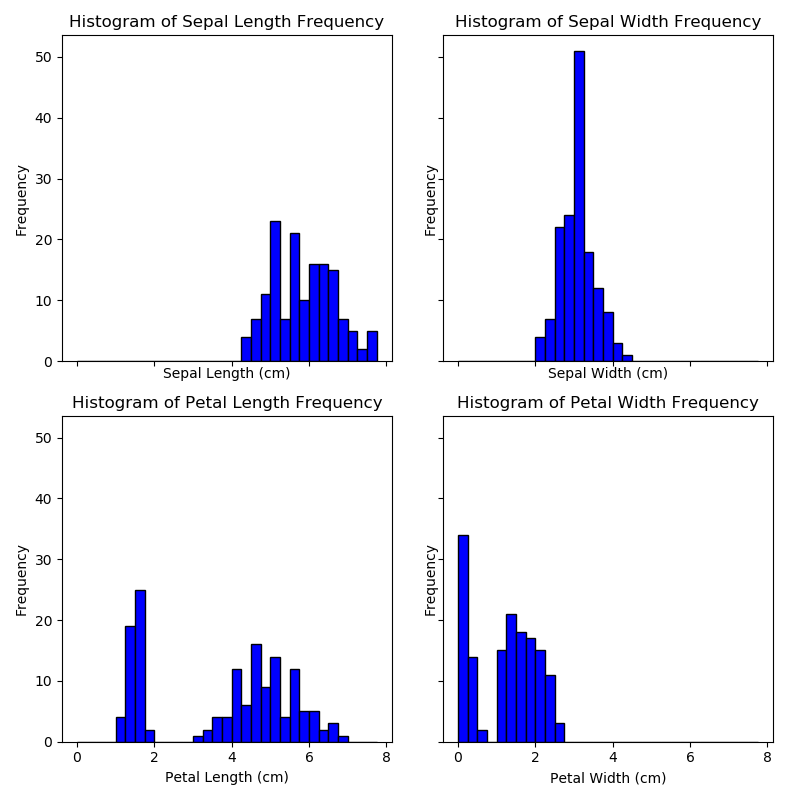

When all three iris types are plotted together on a histogram (with no way of differentiating which is which), the conclusions we can draw are somewhat limited. 

Here we can see that sepal lengths are spread between 4cm and 8cm, with the median sitting around 5.8cm, meanwhile the sepal widths are a lot more concentrated between 2cm and 4.4cm, with 3cm showing a clear concentration of measurements. 

Petal length is a lot more dispersed, ranging from 1cm to 6.9cm, and the gap between 2cm and 3cm does suggest that one of the Iris types might have shorter petals than the others. Petal Width is concentrated between 0.1cm and 2.5cm, and the fact that 0.2 cm has a clear spike, followed by consistent frequencies at the higher end of the range (around 2cm) also suggests that one iris type might have shorter and thinner petals than the other two types.

We can see these oberservations supported by the summary statistics for the entire data set in analysis.txt:

    Sepal Length Summary
    The median measurement of Sepal Length is 5.8.
    The minimum measurement of Sepal Length is 4.3.
    The maximum measurement of Sepal Length is 7.9.
    The standard deviation of Sepal Length is 0.83.
    The mean of Sepal Length is 5.84.

    Sepal Width Summary
    The median measurement of Sepal Width is 3.0.
    The minimum measurement of Sepal Width is 2.0.
    The maximum measurement of Sepal Width is 4.4.
    The standard deviation of Sepal Width is 0.43.
    The mean of Sepal Width is 3.05.

    Petal Length Summary
    The median measurement of Petal Length is 4.35.
    The minimum measurement of Petal Length is 1.0.
    The maximum measurement of Petal Length is 6.9.
    The standard deviation of Petal Length is 1.76.
    The mean of Petal Length is 3.76.

    Petal Width Summary
    The median measurement of Petal Width is 1.3.
    The minimum measurement of Petal Width is 0.1.
    The maximum measurement of Petal Width is 2.5.
    The standard deviation of Petal Width is 0.76.
    The mean of Petal Width is 1.2.

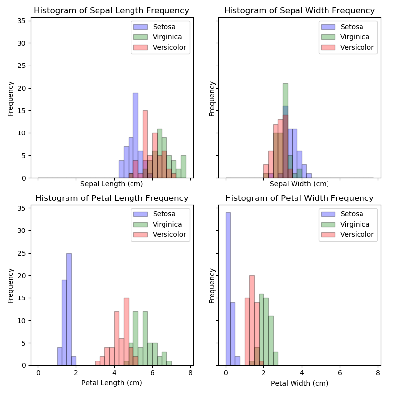

When we differentiate the three Iris types by colour, we can begin to pick out some trends among the histograms. The sepal length and sepal width histograms don't highlight any major differences, other than the fact setosa's have the shortest sepals, followed by versicolors, although all within a tight range of measurements. However when it comes to petal length and petal width we see a clear hierarchy that is consistent with the assumptions made on the overall histograms above. Iris Setosa has shorter and thinner petals than Iris Versicolor, which then in turn has shorter and thinner petals than Iris Virginica. 

From these histograms we can begin piecing together the observation that Irises with short, thin petals and slightly shorter sepals are likely Iris Setosas, meanwhile the larger end of the scale is likely to be Iris Versicolor. Our next step is to see if there is a relationship between these measurements on a given Iris flower.

### Scatter Plots

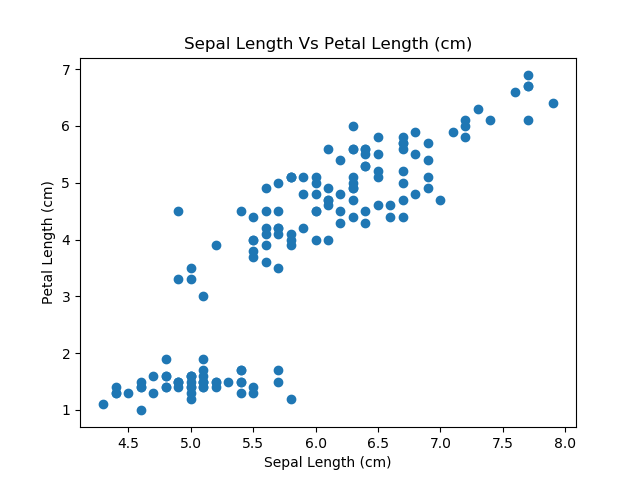
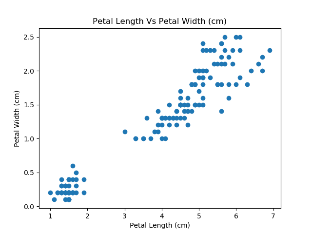
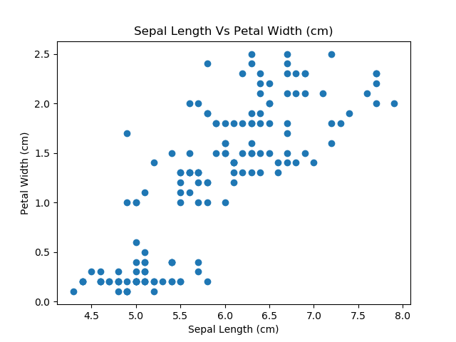
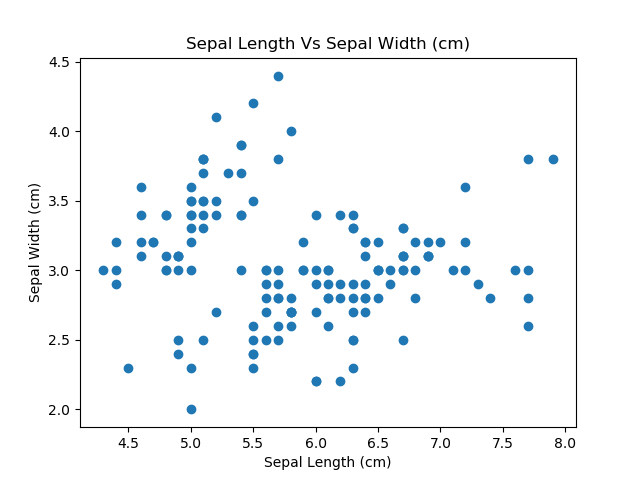
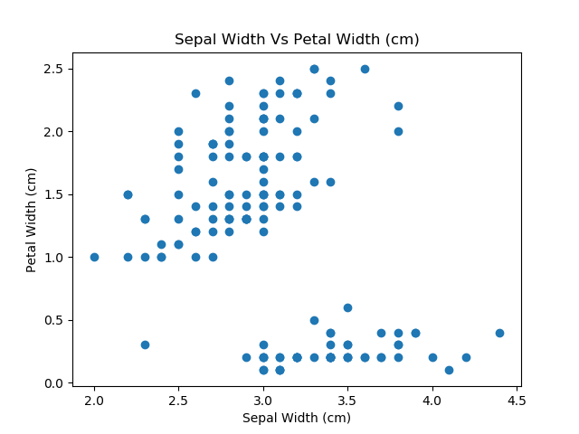
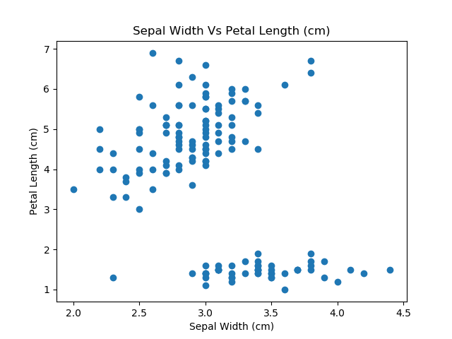

Similarly to the histograms above, when all three Iris types are plotted together on a scatter plot, with no way of discerning which point is which type, we are somewhat limited in what we can conclude. From these we can see that Petal Length vs Petal Width, and Sepal Length vs Petal Length have quite clear relationships, as the points fall fairly linearly on a straight line up and to the right. This tells us that as the length of a petal increases on a an Iris, we can expect the petals to be wider, and the sepal to also be longer.

Sepal Length vs Petal Width also suggests a slight relationship between the two measurements, as the points do still share that up and to the right trajectory, however the points do not fall quite as linearly. This suggests that while there is a relationship between petal length and petal width, it's not as close as the three aforementioned combinations.

Meanwhile Sepal Length vs Sepal Width, Sepal Width vs Petal Length and Sepal Width vs Petal Width do not show clear relationships across the data set as a whole, however the gaps between the concentrations of points do suggest that there may be relationships for these measurements for each individual Iris type.

When we differentiate the three Iris types by colour, we can see much closer relationships between the measumrents for each Iris individually.

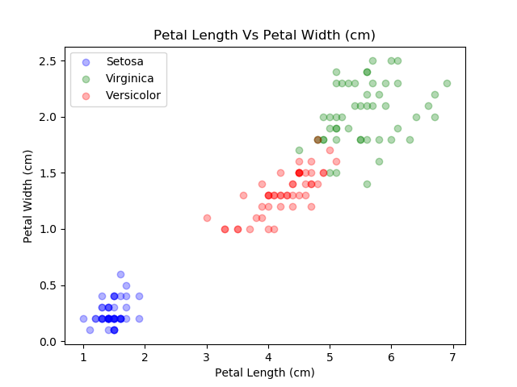

Petal Length vs Petal Width shows a clear correlation between the two measurements, and that it is consistent among two of the three iris types. As petals get longer, they will also get wider, especially for Iris Virginica and Iris Versicolor. Iris Setosa's measurements show that the relationship for this particular Iris type is not as consistent, and so it is not possible to draw the same conclusion for setosas.

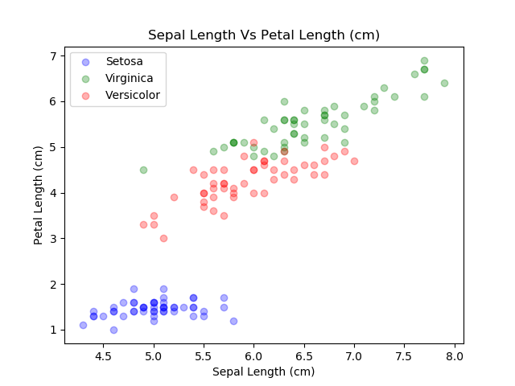

Sepal Length vs Petal Length similarly shows a clearer relationship between these two measurements for Iris Virginica and Iris Versicolor, whereas Iris Setosa doesn't appear to have a clear relationship between Sepal Length and Petal Length. In the case of Iris Setosa, it would seem that petal length doesn't go above beyond 2cm, no matter how long the sepal is, whereas for the other two Iris types, the petal and sepal lengths go more hand in hand. 

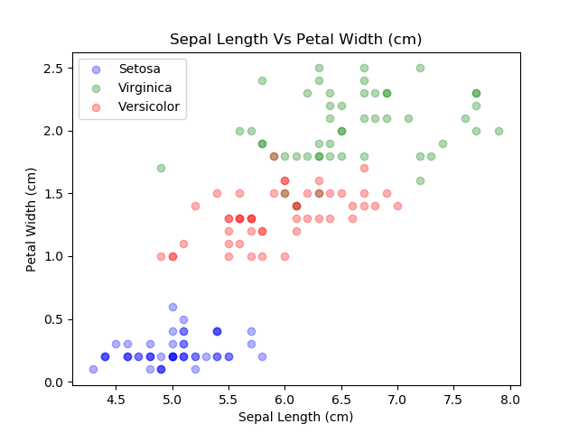

When we can see the three different Iris types on this scatter plot, the relationships are lot clearer. Whereas before the points looked quite unrelated, we can now see a slight relationship between sepal width and sepal length for Iris Versicolor, and no clear relationship for the Setosa or Virginica. Once again it seems that Iris Setosa's petal width wll remain between 0.1 and 0.6 cm regardless of the sepal width.

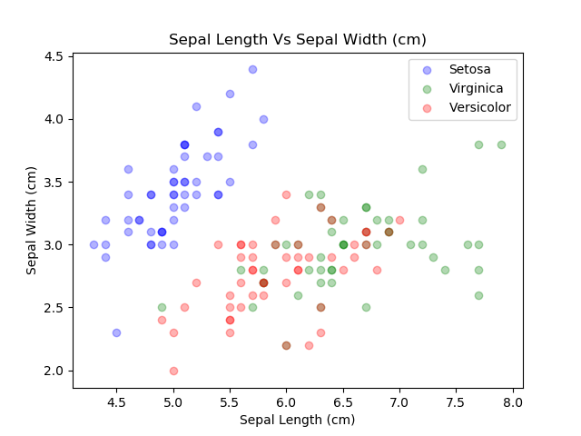

This is another plot where the different colours for each Iris type make it easier to see a pattern. There's a strong relationship between the sepal length and sepal width for Iris Setosa, with a sharp incline up and to the right showing that as speal length increases, as does sepal width. For Iris Versicolor and Iris Virginica this relationship is a lot less pronounced with a number of outliers meaning the points are not as linear.

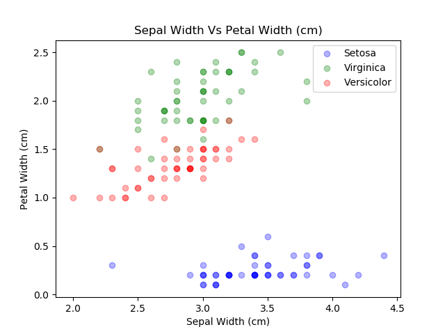

Iris Versicolor appears to have a strong relationship between sepal width and petal width whereby as one increases as does the other. The correlation for Iris Virginica is less pronounced although there does appear to be some relationship as it still generally follows the up and to the right pattern. Meanwhile Iris Setosa against has the limited petal width which doesn't see much variation regardless of sepal width.

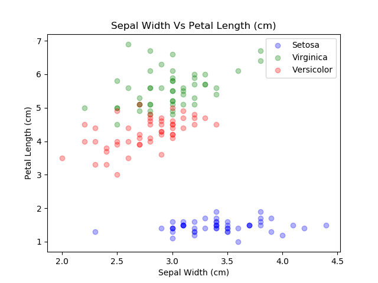

Similar to above, the sepal width and petal length show a strong correlation for Iris Versicolor, a weaker correlation for Iris Virginica, and no correlation for Iris Setosa.

Overall we can see that the petal length or width for Iris Setosa has little to no bearing when compared to any of the other measurements, hoowever the sepal width and sepal length for the iris type have a strong correlation, as one grows so does the other. Meanwhile Iris Versicolor has much tighter relationships between each pairing with the exception of sepal length vs sepal width, thus suggestion that the size of the petals dictate the size of both petals and sepals. Iris Virginica has a strong correlation when looking at the two petal measurements together, however much looser relationships when petals and sepals are compared, and little to no relationshp when sepal length and width is compared to each other, and so this more loosely follows the Iris Versicolor trend of petals sizes being the key variables. 

### Pairplot

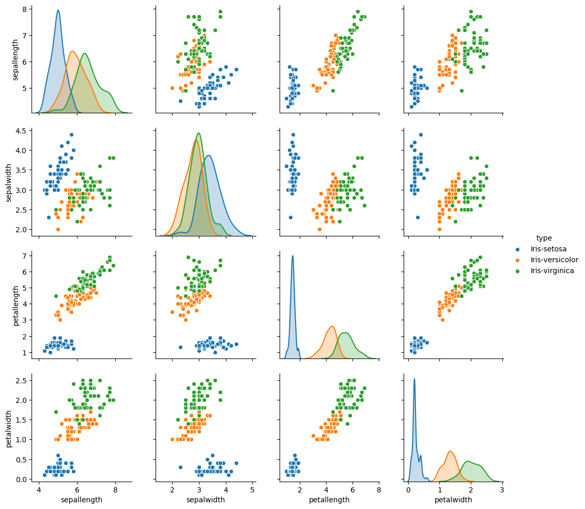

This pairplot shows the histograms and scatter plots outlined above, but with them all on one figure. This makes it easier to see that the Iris Setosa is generally smaller on every measure exception the sepal width, and that the smaller petal lengths and widths mean there's little correlation for the Setosa points on each of the scatter plots. Meanwhile the closer relationships seem on the Iris Virginica and Iris Versicolor outlined above are easier to observe, with the petal length and width being the key measurements for Iris Versicolor and Iris Virginica.

### Box Plots, Violin Plots & Cat Plots

#### Petal Length

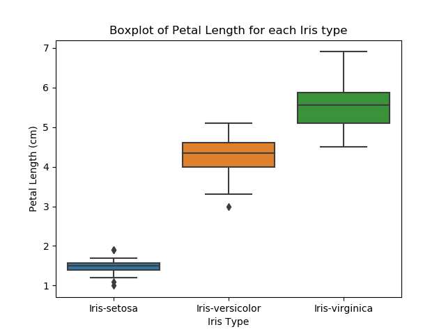
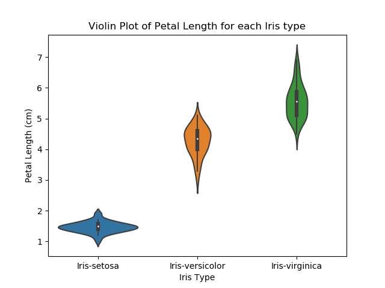
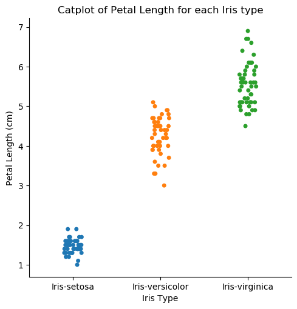

#### Petal Width

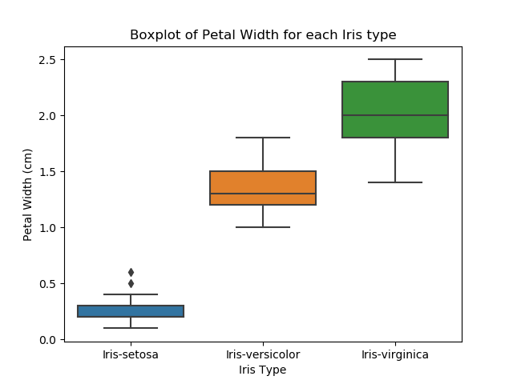
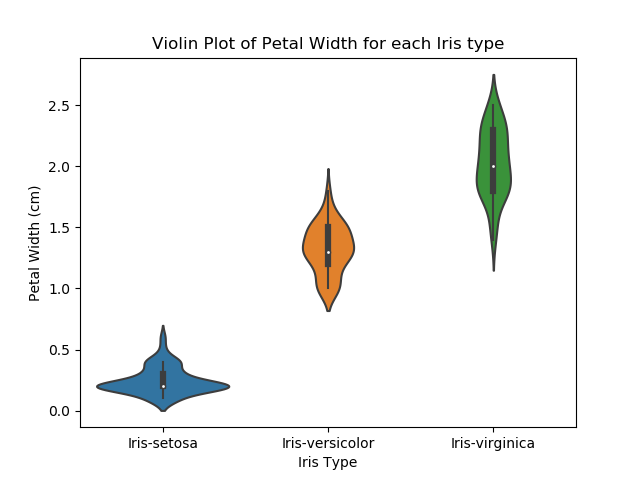
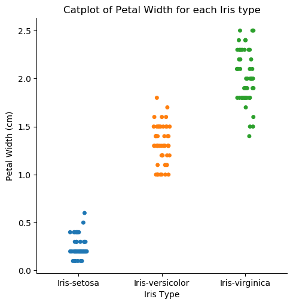

#### Sepal Length

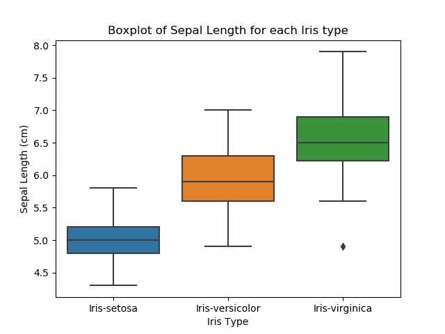

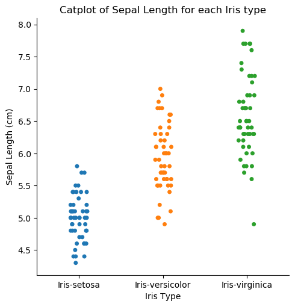

#### Sepal Width

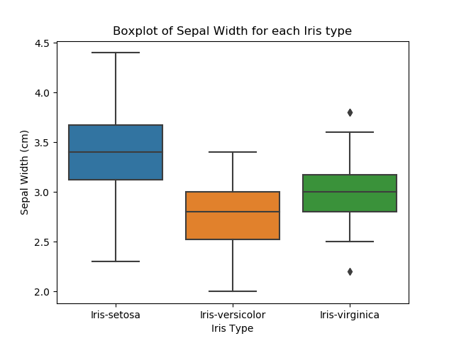
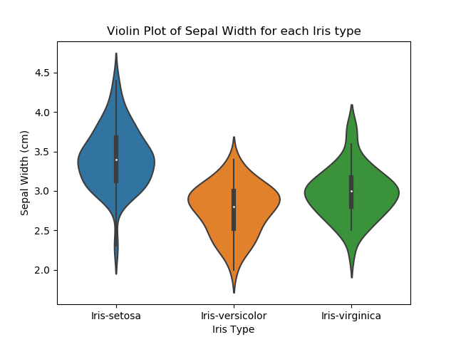
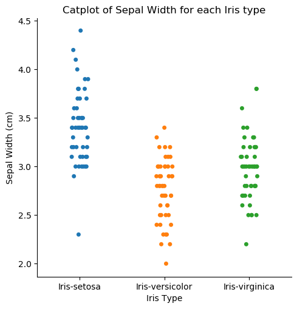

### Heat Maps

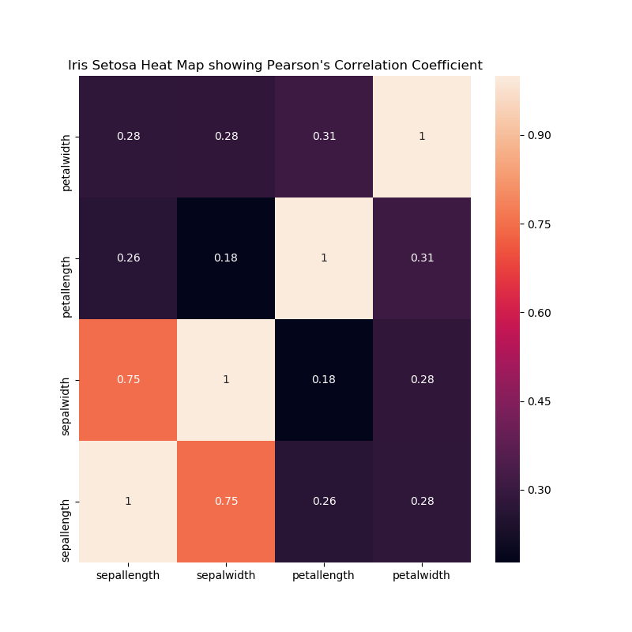
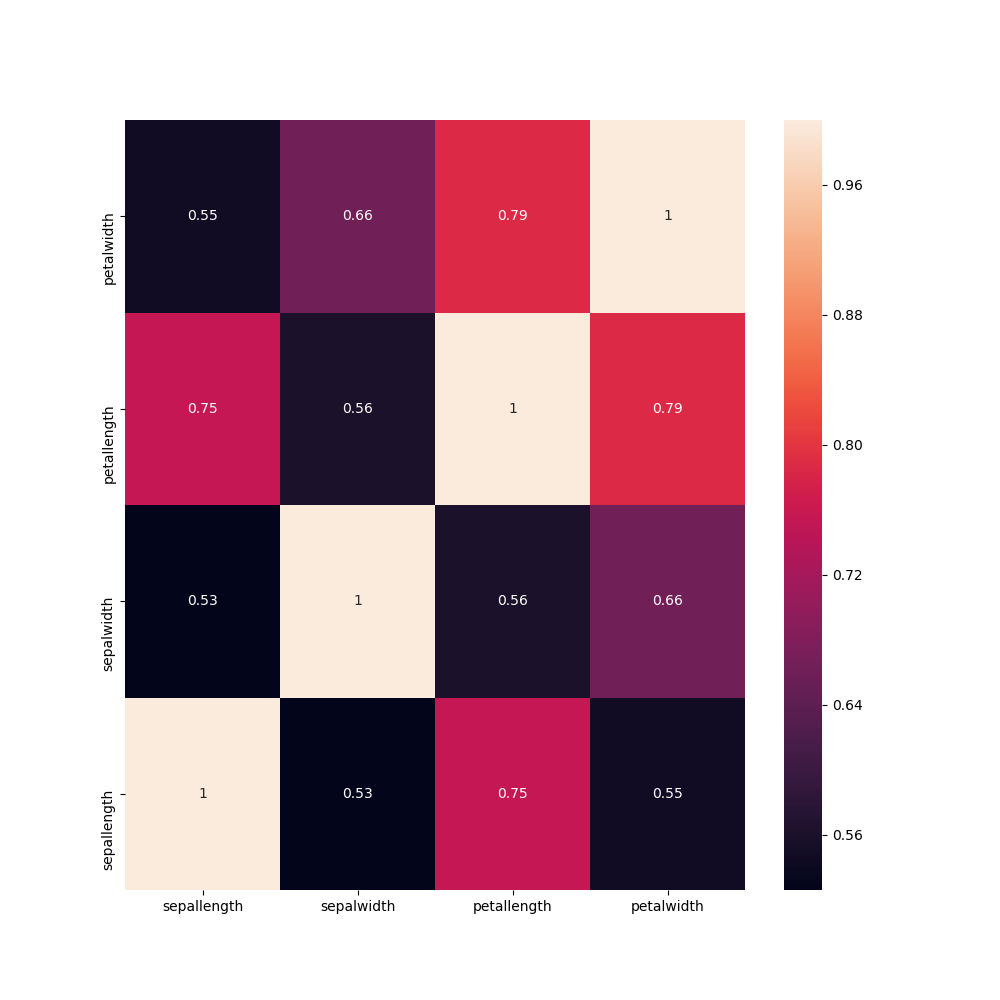
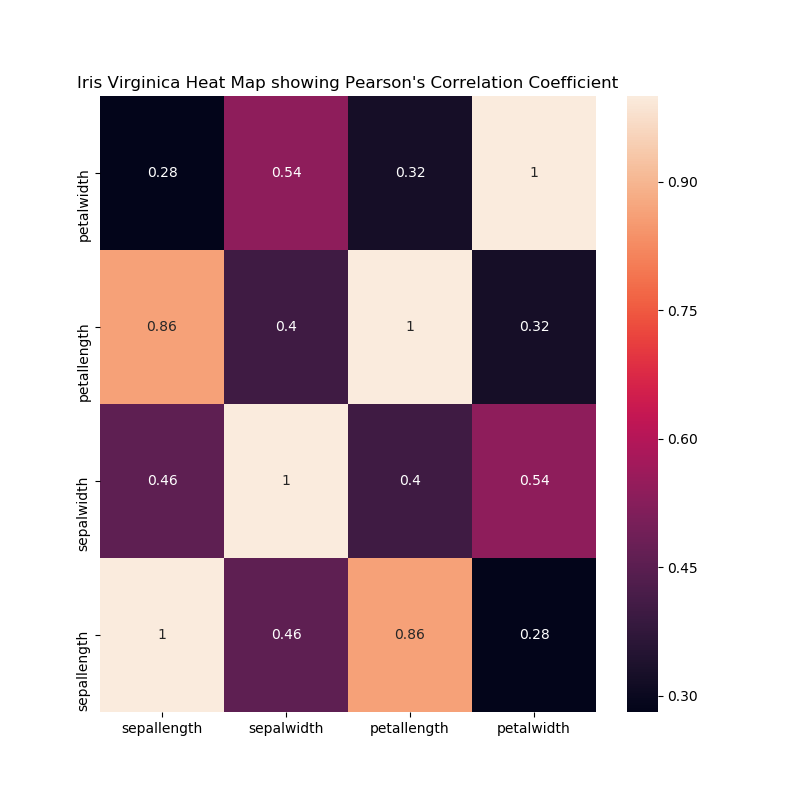

## Summary and Conclusions

What do all of these tell us? How can we be sure we're looking at a particular type of Iris.

# External Research conducted by others

## External Conclusions and Alignment with Mine

