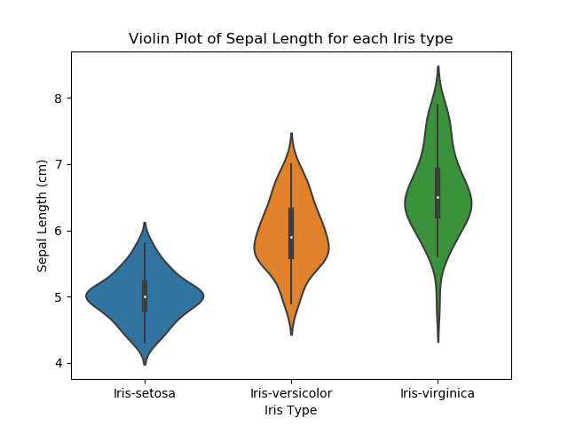
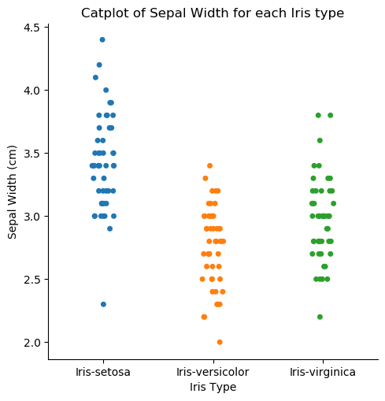

# Fisher's Iris Data Set Analysis

# Contents
[1. Introduction](#introduction)

[1.1 How to use this GitHub Repository](#how-to-use-this-github-repository)

[1.2 What is Fisher's Iris Data Set?](#what-is-fishers-iris-data-set)

[1.3 Why is this data set used?](#why-is-this-data-set-used)

[1.4 Any controversies regarding this data set?](#any-controversies-regarding-this-data-set)

[2. Creation of the Program](#creation-of-the-program)

[2.1 Libraries Used in this Program](#libraries-used-in-this-program)

[2.2 Plots Used in this Program](#plots-used-in-this-program)

[3. Analysis - Findings](#analysis-findings)

[3.1 Plots and Summary Statistics](#plots-and-summary-statistics)

[3.2 Summary and Conclusions](#summary-and-conclusions)

[4.0 External Research conducted by Others](#external-research-conducted-by-others)

[4.1 External Conclusions and Alignment with Mine](#external-conclusions-and-alignment-with-mine)

[5.0 References and Resources](#references-and-resources)

# Introduction

This GitHub repository contains Brian Doheny's project for the 2020 Programming and Scripting module at GMIT. 

Here you'll find the famous Fisher's Iris Data Set (iris_csv.csv), a program (irisAnalysis.py) that will create a number of plots (found in the plots folder) alongside summary statistics (analysis.txt), and the aforementioned files created by the program.

## How to use this GitHub Repository

The root folder contains the following files and folders
* iris_csv.csv - A CSV file containing Fisher's Iris Data Set. This file contains 5 columns containing measurements of the sepal length, sepal width, petal length, petal width and iris type for 150 iris flowers.
* irisAnalysis.py - A Python program that loads iris_csv.csv into a dataframe, and performs numerous plots. You can find these plots in the "plots" folder.
* analysis.txt - A text file containing summary statistics from iris_csv.csv. Here you'll find the mean, median, minimum, maximum and standard deviation for each of the four measurements in the CSV file, along with the respective measurements for each type of iris flower, and Pearson's correlation coefficient for each measurement on each type of iris flower.
* LICENSE - An MIT license for this Github repository.
* README.md - You are currently reading this file.
* plots/ - This folder and subsequent folders contains all of the png files created by irisAnalysis.py. Each type of plot has its own subfolder based on its type - histograms (plots/histograms/), scatter plots (plots/scatterplots/), heatmaps (plots/heatmaps/) and cat, box and violin plots (/plots/boxViolinCat/)
* planning/ - This folder contains my notes and plans for this project, along with the specifications for the project as outlined in the project document shared with us. I've also included a timeline for my own use, although COVID-19 related disruptions meant the original timeline could not be met.

You can download this GitHub repository to your local device and run the program by following these steps:
1. On the right hand side of this repository, you'll find the "Clone or download" button. Click this, then copy the HTTPS URL (this can be done by clicking the clipboard icon).

2. In your command line interface (e.g. Terminal on a Mac), navigate to the directory where you'd like to download the repository to.
3. While in the desired directory, type "git clone" and paste the url (i.e. "git clone [paste url here]").
4. Hit enter and the repository will be downloaded into that directory.
5. You can then run the irisAnalysis.py program by typing "python irisAnalysis.py" while in the directory that contains the irisAnalysis.py program. (Note: You will need to have Python 3.7 installed, along with matplotlib, pandas, seaborn and numpy. All of these are available in the [Anaconda package which you find here](https://www.anaconda.com/products/individual))

## What is Fisher's Iris Data Set?

Fisher's Iris Data Set is a set of data that contains the measurements of the sepal length, sepal width, petal length and petal width of three types of iris flower - Iris Setosa, Iris Virginica and Iris Versicolor. Although this data set was made famous by Ronald Fisher's paper "The use of multiple measurements in taxonomic problems", it was actually gathered by Edgar Anderson. The data set contains the aforementioned measurements for 150 iris flowers, with each of the three iris types represented by 50 observations each.

## Why is this data set used?

This data set is often used to introduce students to multivariate data analysis, as well as for machine learning studies, as it is a relatively small data set at 150 observations, while still being just large enough for skills building. Meanwhile the limited number of variants (i.e. the four measurements on each flower) alongside the small set of categories (i.e. the three types of iris flower that were measured) allow students to practice various plotting techniques with real data. Finally, Ronald Fisher himself was a well respected statistician and his impact on the field of statistics is still felt today, and this likely led to the initial popularity of this data set for teaching.

## Any controversies regarding this data set?

While studying this data set, it became apparent that there is some mild controversy in the field of botany regarding the definition of sepals and petals in the case of iris flowers ([as can be seen here](https://www.researchgate.net/publication/237010807_What_should_we_know_about_the_famous_Iris_data)). That said, this particular controversy does not spill over into the field of statistics, data analysis or machine learning, and so doesn't impact this particular project. 

# Creation of the program

## Libraries Used in this Program

For this project, I have used the following Python Libraries:

* Pandas - Pandas is a library made specifically for creating and manipulating data frames in Python. These two dimensional data structures (i.e. they have rows as well as columns) allow data scientists to select and manipulate the data to their requirements. This allows for easier plotting, whether that be via Panda's own plotting functionality, or via other libraries. In this project, Pandas has been used to create a data frame from the iris_csv.csv file, and then structure the data frame so that I could make the desired plots.
* Matplotlib.pyplot - Matplotlib is the most popular library for creating plots in Python, and in fact numerous other libraries for plotting are based on the functionality of Matplotlib. In this project I have used matplotlib.pyplot to create histograms and scatter plots for the various measurements in the data set.
* Seaborn - Seaborn is another popular library for creating plots in Python, and is based on the functionality introduced by Matplotlib. Seaborn introduces a few new plot types, as well as some more aesthetically pleasing default settings for those plots. In this project I've used Seaborn for Cat Plots, Box Plots, Violin Plots, Heat Maps and a Pair Plot.

## Plots Used in irisAnalysis.py

### Histograms 
Histograms are used to show the frequency with which observations fall within specified ranges (also known as "bins"). In the case of this data set, bins were specified at every 0.25cm, and the number of measurements (the observations) that fell within a given range is counted. For example how many Petal Lengths are between 1.75cm and 2cm.

Initially I plotted the entire dataset into histograms, thus displaying the combined data for all three iris types. I was then able to separately plot each iris type onto a histogram for each measurement, with different colours representing the three different types, thus allowing us to see how the ranges of measurements in each iris type differs. I have included the initial histograms in this program so as to highlight this evolution in my analysis.

These histograms are created by utilising a FOR loop, which will iterate through each of the four columns and plot them to a histogram. These were created with matplotlib, the documentation for which can be [found here](https://matplotlib.org/3.2.1/api/_as_gen/matplotlib.pyplot.hist.html).

### Scatter Plot 
Scatter plots help to show relationships between two variables when plotted against each other. For example when Petal Length is plotted against Petal Width. 

I was able to create a method of plotting each of the measurements against each other through the use of a  While loop which would iterate through each column and perform a Scatter function that I had previously defined. Initially, the Scatter function plotted the data for all three iris types together, with no way to differentiate which measurement came from which type. 

This was improved upon with the Scatter2 function, which required slicing the full dataset into three smaller versions for each iris type, and plotting these separate slices onto the same figure. This allowed me to set a specific colour for each iris type, and thus allow us to see any trends more clearly. I have left the initial Scatter function in the program so as to highlight this evolution in my analysis.

These scatter plots were created with matplotlib, the documentation for which can be [found here](https://matplotlib.org/3.2.1/api/_as_gen/matplotlib.pyplot.scatter.html).

### Pair Plot
A pair plot is actually a series of plots on one figure, whereby each variable is plotted against each other on scatter plots, alongside histograms of the individual variables. 

Although the pair plot effectively does the work of all of my histograms and scatter plots in one figure, I left them my pre-existing code in the program so as to show that I wasn't fully reliant on Seaborn's pairplot for this analysis. The documentation for Seaborn's pairplot can be [found here](https://seaborn.pydata.org/generated/seaborn.pairplot.html)

### Box Plot
A box plot allows us to see how measurements across various categories compare. The plot itself consists of a box with two "whiskers" either side of it. The limit of the top whisker shows the maximum measurement, while the limit of the bottom whisker shows the minimum measurement. Meanwhile the top edge of the box shows the upper quartile, the bottom edge shows the lower quartile, and the line intersecting the box shows the median. This means that in one simple illustration we can see the maximum, minimum, and the three quartile measurements in between. Any outliers or suspected erroneous measurements will appear as diamonds, beyond the end of either whisker.

For this data set I plotted each iris type against each of the four variables - Sepal Length, Sepal Width, Petal Length and Petal Width.

These box plots are created by utilising a FOR loop, which will iterate through each of the four columns and plot them to a box plot. Seaborn was used to create these box plots, the documentation for which can be [found here](https://seaborn.pydata.org/generated/seaborn.boxplot.html).

### Violin Plot
Violin plots are similar to box plots in that they allow us to compare multiple categories against a variable. One key difference is that the width of the "violin" illustrates where the concentration of measurements fall in the range, with wider areas showing higher concentrations.

For this data set I plotted each iris type against each of the four measurements, just like with the box plots. My program also utilises a similar FOR loop to create the violin plots as is used for the box plots. Seaborn was used to create these violin plots, the documentation for which can be [found here](https://seaborn.pydata.org/generated/seaborn.violinplot.html).

### Cat Plot
Cat Plots share similarities with box plots and violin plots in that they show different categories against a certain variable. The key difference here is that the information is shown as points on the plot, so each of the individual measurements can be seen. 

The cat plots in this program involve the same categories and variables as the box plots and violin plots, and utilises a similar FOR loop to create the plots. Seaborn was used to create these cat plots, the documentation for which can be [found here](https://seaborn.pydata.org/generated/seaborn.catplot.html).

### Heat Maps
Heat maps highlight whether two variables have a correlation (i.e. that one measurement influences the other). In the case of the heat maps created by my program, the paler the colour of the box, the more of a correlation there is, and thus the greater likelihood that the two variables influence each other. 

For my heat maps, I used Pearson's Correlation Coefficient ([you can find out about this here](https://www.spss-tutorials.com/pearson-correlation-coefficient/)) and so a coefficient close to 1 means that the two variables are positively related (i.e. as one increases, so does the other). Likewise, a coefficient closer to -1 would mean the two variables are negatively related (i.e. as one increases the other decreases). A coefficient closer to 0 suggests no correlation, and thus the two variables are not related.

My program produces a heat map for each of the three iris types, with the heat map showing the correlation coefficients for each variable against each other. Seaborn was used to create these heat maps, the documentation for which can be [found here](https://seaborn.pydata.org/generated/seaborn.heatmap.html).

### Analysis.txt
Along with the PNG files containing each of my plots, my program also creates the "analysis.txt" file. This file contains summary statistics for each of the four variables for the data set as a whole, as well as for each iris type individually. I have also included the Pearson's Correlation Coefficient matrix for each of the three iris types, which is also illustrated on the heat maps (found in /plots/heatmaps).

The summary statistics provided for each of the variables are the mean, median, minimum, maximum and the standard deviation.

# Analysis - Findings

## Plots and Summary Statistics

### Histograms & Summary Statistics

When all three iris types are plotted together on a histogram (with no way of differentiating which is which), the conclusions we can draw are somewhat limited. 

Here we can see that sepal lengths are spread between 4cm and 8cm, with the median sitting around 5.8cm, meanwhile the sepal widths are a lot more concentrated between 2cm and 4.4cm, with 3cm showing a clear concentration of measurements. 

Petal length is a lot more dispersed, ranging from 1cm to 6.9cm, and the gap between 2cm and 3cm does suggest that one of the iris types might have shorter petals than the others. Petal width is concentrated between 0.1cm and 2.5cm, and the fact that 0.2 cm has a clear spike, followed by consistent frequencies at the higher end of the range (around 2cm) also suggests that one iris type might have shorter and thinner petals than the other two types.

We can see these observations supported by the summary statistics for the entire data set in analysis.txt:

    Sepal Length Summary
    The median measurement of Sepal Length is 5.8.
    The minimum measurement of Sepal Length is 4.3.
    The maximum measurement of Sepal Length is 7.9.
    The standard deviation of Sepal Length is 0.83.
    The mean of Sepal Length is 5.84.

    Sepal Width Summary
    The median measurement of Sepal Width is 3.0.
    The minimum measurement of Sepal Width is 2.0.
    The maximum measurement of Sepal Width is 4.4.
    The standard deviation of Sepal Width is 0.43.
    The mean of Sepal Width is 3.05.

    Petal Length Summary
    The median measurement of Petal Length is 4.35.
    The minimum measurement of Petal Length is 1.0.
    The maximum measurement of Petal Length is 6.9.
    The standard deviation of Petal Length is 1.76.
    The mean of Petal Length is 3.76.

    Petal Width Summary
    The median measurement of Petal Width is 1.3.
    The minimum measurement of Petal Width is 0.1.
    The maximum measurement of Petal Width is 2.5.
    The standard deviation of Petal Width is 0.76.
    The mean of Petal Width is 1.2.

When we differentiate the three iris types by colour, we can begin to pick out some trends among the histograms. The sepal length and sepal width histograms don't highlight any major differences, other than the fact setosas have the shortest sepals, followed by versicolors (although all are within a tight range of measurements). However, when it comes to petal length and petal width we see a clear hierarchy that is consistent with the assumptions made on the overall histograms above. Setosas have shorter and thinner petals than versicolors, which then in turn has shorter and thinner petals than virginicas. 

From these histograms we can begin piecing together the observation that irises with short, thin petals and slightly shorter sepals are likely to be setosas. Meanwhile if the measurements are at the larger end of the scale, it is likely to be a versicolor. This is also supported by the summary statistics found in analysis.txt

    Petal Length Summary Stastics by Iris Type
                    median  min  max       std   mean
    type                                              
    Iris-setosa        1.50  1.0  1.9  0.173511  1.464
    Iris-versicolor    4.35  3.0  5.1  0.469911  4.260
    Iris-virginica     5.55  4.5  6.9  0.551895  5.552

    Petal Width Summary Stastics by Iris Type
                    median  min  max       std   mean
    type                                              
    Iris-setosa         0.2  0.1  0.6  0.107210  0.244
    Iris-versicolor     1.3  1.0  1.8  0.197753  1.326
    Iris-virginica      2.0  1.4  2.5  0.274650  2.026

    Sepal Length Summary Stastics by Iris Type
                    median  min  max       std   mean
    type                                              
    Iris-setosa         5.0  4.3  5.8  0.352490  5.006
    Iris-versicolor     5.9  4.9  7.0  0.516171  5.936
    Iris-virginica      6.5  4.9  7.9  0.635880  6.588

    Sepal Width Summary Stastics by Iris Type
                    median  min  max       std   mean
    type                                              
    Iris-setosa         3.4  2.3  4.4  0.381024  3.418
    Iris-versicolor     2.8  2.0  3.4  0.313798  2.770
    Iris-virginica      3.0  2.2  3.8  0.322497  2.974

Our next step is to see if there is a relationship between these measurements on a given iris flower.

### Scatter Plots

Similarly to the histograms above, when all three iris types are plotted together on a scatter plot, with no way of discerning which point is which type, we are somewhat limited in what we can conclude. 

From these we can see that petal length versus petal width, and sepal length versus petal length have quite clear relationships, as the points fall fairly linearly on a straight line going up and to the right. This tells us that as the length of a petal increases on an iris, we can expect the petals to be wider, and the sepal to also be longer.

Sepal length versus petal width also suggests a slight relationship between the two measurements, as the points do still share that up and to the right trajectory, however the points do not fall quite as linearly. This suggests that while there is a relationship between petal length and petal width, it's not as close as the two aforementioned combinations (petal length & petal width, petal length & sepal length).

Meanwhile sepal length versus sepal width, sepal width versus petal length, and sepal width versus petal width do not show clear relationships across the data set as a whole. However, the gaps between the concentrations of points do suggest that there may be relationships for these measurements for each individual iris type.

When we differentiate the three iris types by adding separate colours, we can see much closer relationships between the measurements for each iris individually.

Petal length versus petal width shows a clear correlation between the two measurements, and that it is consistent among two of the three iris types. As petals get longer, they will also get wider, especially for virginica and versicolor. Setosa's measurements show that the relationship for this particular iris type is not as consistent, and so it is not possible to draw the same conclusion for setosas.

Sepal length vs petal length similarly shows a clearer relationship between these two measurements for  virginica and versicolor, whereas setosa doesn't appear to have a clear relationship for this combination. In the case of setosas, it would seem that petal length doesn't grow beyond 2cm, no matter how long the sepal is, whereas for the other two iris types, the petal and sepal lengths go more hand in hand. 

When we can see the three different iris types on this scatter plot, the relationships are a lot clearer. Whereas before the points looked quite unrelated, we can now see a slight relationship between sepal width and sepal length for versicolors, and no clear relationship for setosas or virginicas. Once again it seems that the petal width of setosas will remain between 0.1cm and 0.6cm regardless of the sepal width.

This is another plot where the different colours for each iris type make it easier to see a pattern. There's a strong relationship between the sepal length and sepal width for setosas, with a sharp incline up and to the right showing that as sepal length increases, as does sepal width. For versicolors and virginicas this relationship is a lot less pronounced with a number of outliers meaning the points are not as linear.

 Versicolors appear to have a strong relationship between sepal width and petal width whereby as one increases as does the other. The correlation for virginicas is less pronounced although there does appear to be some relationship as it still generally follows the up and to the right pattern. Meanwhile setosa again have the limited petal width which doesn't see much variation regardless of sepal width.

Similar to above, the sepal width and petal length show a strong correlation for versicolors, a weaker correlation for virginicas, and no correlation for setosas.

Overall we can see that the petal length or width for setosas has little to no bearing when compared to any of the other measurements. However, the sepal width and sepal length for this iris type have a strong correlation, as one grows so does the other. Meanwhile, versicolors have much tighter relationships between each pairing with the exception of sepal length versus sepal width, thus suggesting that the size of the petals dictate the size of both petals and sepals. Virginicas have a strong correlation when looking at the two petal measurements together. However, it shows much looser relationships when petals and sepals are compared, and little to no relationship when sepal length and width is compared to each other, and so this more loosely follows the versicolor trend of petals sizes being the key variables. 

### Pairplot

This pairplot shows the histograms and scatter plots outlined above, but with them all on one figure. This makes it easier to see that the setosas are generally smaller on every measure with the exception of the sepal width. We can also see that the smaller petal lengths and widths mean there's little correlation among the setosa points on each of the scatter plots. Meanwhile the closer relationships seen with the virginica and versicolor measurements outlined above are easier to observe, with the petal length and width being the key measurements for these two types.

### Heat Maps

Here we can see that there's a strong correlation between sepal length and sepal width for setosas, as a coefficient of 0.7 or more is typically accepted as having a strong correlation. Therefore we can assume that for setosas, as sepal width increases, so does its length. As for the other measurements, petal length and petal width have a correlation coefficient of 0.31 which would make it a weak to moderate correlation. 

The versicolor heat map suggests there is a correlation between each of the measurements. Petal length and petal width has the strongest at 0.79, followed closely by petal length and sepal length at 0.75, both falling into the strong correlation category of 0.7 and above. Meanwhile all the other measures are at least 0.53, which would be a moderate correlation. Therefore we can assume that as any of the four measurements increases all of them will increase, with particular accuracy when it comes to the petal length's relationship with the petal width and sepal length.

The virginica heat map includes the strongest correlation of any of the measurements across all three iris types, as we can see that petal length and sepal length have a Pearson's correlation coefficient of 0.86 - well above the 0.7 that is generally considered a strong correlation. Therefore we can assume with good certainty that as the petals on virginicas get longer, so do their sepals, and vice versa. Sepal width and petal width also share a moderate correlation at 0.54, whereas the other measurements are in the weak-moderate correlation band as they are from 0.28 through to 0.46.

### Box Plots, Violin Plots & Cat Plots

#### Petal Length

As shown in the histograms and scatter plots, setosa petal lengths are much shorter than that of versicolor and virginica. Similarly the range of measurements for setosas are also very tight, with the longest being just 1.9cm, as evidenced by the lower quartile, median and upper quartile on the box plot all being within 0.2cm of each other. We can see from the violin plot that the bulk of the measurements for setosas are around 1.5cm, which makes sense as the quartiles are all around that measure too.

Versicolors have a bit of a wider range of measurements, going from around 3.2cm to 5.1cm. As shown on the box plot, the lower quartile is at 4cm, the median is at 4.4cm, and the upper quartile is around 4.6cm. The violin plot shows a more even distribution of measurements across the range, with a concentration between 4cm to 5cm, as supported by the cluster of points on the cat plot.

As was shown in the histograms, virginicas generally have the longest petals, with its range starting at 4.5cm, going up to 6.9cm. The boxplot shows us that the lower quartile is at 5.1cm, so we know that 75% of the virginica petals were longer than the maximum versicolour measurement. The median is at 5.5cm, and the upper quartile is at 6.9cm. This interquartile range is the largest of the three, at 1.8cm, and shows that there is a wider variation in virginica petal lengths, then there are for setosa or versicolor petal lengths, and we can see this by the more slender and consistent violin plot and cat plot points.

#### Petal Width

Once again we can see the clear representation of the thinner petals found on setosas, and the small range of petal widths going from 0.1cm to 0.6cm. Interestingly here, the boxplot actually shows 0.4cm as the maximum measurement, with the 0.5cm and 0.6cm measurements being shown as outliers (as depicted by the diamonds). This is likely because they sit relatively far beyond the upper quartile which is 0.4cm. The box plot also shows us that the lower quartile is at 0.3cm, although we cannot see the median due to the tight interquartile range on this plot. Therefore we must look to the violin plot where we see a clear concentration of points around 0.2cm, suggesting that this is the median. The violin plot also shows why the 0.5cm and 0.6cm measurements appear as outliers on the box plot, as we see the sharp point up to 0.6cm showing that it is in fact an outlier (although hopefully not an erroneous measurement).

The petal width of versicolors has a large range from 1cm to 1.7cm, with the three quartiles at 1.2cm, 1.3cm and 1.5cm, respectively. The violin plot for versicolor also shows that the maximum points are quite far from the bulk of the measurements, as illustrated by the sharp point at the top. Other than that the points are quite evenly spread from 1.2cm to 1.6cm, hence the quartile range of 1.2cm to 1.5cm mentioned above. 

Virginicas have a wider total range and wider quartile range of measurements for petal widths than the other two iris types. The total range is from 1.4cm to 2.5cm, with the lower and upper quartiles at 1.7cm and 2.3cm respectively, with a median of 2cm. As with petal lengths, 75% of the petal widths found on virginicas are wider than the maximum measurement for versicolors. Therefore we can assume that if the iris has larger petals, it is most likely a virginica. Meanwhile the distribution of measurements is fairly consistent across the range, as shown by the slender violin and the spread of points on the catplot.

#### Sepal Length

Unlike the petal measurements, the sepal length of setosas have a wider range, going from 4.3cm to 5.9cm, with the three quartiles at 4.8cm, 5cm and 5.2cm respectively. This shows there's a bit more variation in the sepal lengths then we saw with the petal measurements, although the violin plot and cat plot display a concentration of points around the 5cm mark, which explains the tight interquartile range of 0.4cm.

Versicolors have a range of 4.9cm to 7cm, with the three quartiles at 5.6cm, 6cm and 6.4cm. This wider interquartile range is also shown in the violin plot, as the width is less pronounced than that of the setosa, thus illustrating that there is more of an even distribution of measurements.

Virginicas have a range from 5.6cm to 7.9cm, with the quartiles at 6.4cm, 6.5cm and 6.9cm, respectively. Whereas the minimum virginica measurements for petal length and petal width were larger than 75% of versicolor and all setosa measurements, here the minimum virginica sepal length is larger than just 25% of versicolor sepal lengths. That said, there is one outlier measurement for virginica at just 5cm, and as this is so far away from the other measurements, the boxplot is flagging it as an outlier. Likewise the violin plot has a very sharp tip pointing towards it, and we can see it standing alone on the cat plot. Outside of this outlier, the spread of sepal length measurements is fairly evenly distributed along the range.

#### Sepal Width

Due to the overlaps in the histograms earlier, it wasn't immediately clear that setosas tend to have the wider sepal widths, but we can see this quite plainly in these three plots. The box plot tells us that the range for setosa sepal widths is from 2.3cm to 4.4cm, meaning that setosas also have the widest range of the three iris types - unlike in the three other variables where setosas were shown to be more consistent in their sizing. We can also see that the three quartiles for setosas are 3.1cm, 3.4cm and 3.7cm respectively. This means that 75% of setosa sepals are wider than over 75% of virginica and versicolor sepals (the upper quartile for versicolors is 3cm, meanwhile the upper quartile for virginicas is 3.1 cm). Therefore we now know that setosas generally have the shortest and thinnest petals, with the shortest but widest sepals.

As for versicolor and virginica, we see the same trends whereby virginicas are just a bit bigger than versicolors again. The range for versicolors is from 2cm to 3.4 cm, whereas virginicas are at 2.5cm to 3.6cm (although it should be noted that virginica shows an outlier at either end, marked at 2.3cm and 3.8cm). As for their quartiles, versicolors are at 2.5cm, 2.8cm and 3cm respectively, whereas the corresponding figures for virginica are 2.8cm, 3cm and 3.2cm. Thus the differences between virginica and versicolor measurements are a lot less pronounced, and both iris types have a similar distribution of points along their ranges, as shown by the violin and cat plots.

## Summary and Conclusions

From all of these plots, we can make a few assumptions as to how to differentiate between the three iris types:
* An iris with longer petals and sepals, and wider petals than other variations is likely to be a virginica.
* An iris with shorter petals and sepals, thinner petals but the widest sepals is likely to be a setosa.
* An iris that comes up in the middle of each of these four measurements is likely to be a versicolor.

We can also make some conclusions on the relationship between each measurement for each iris type:
* For setosas, the sepal width and petal width are closely related, where as one increases the other likely will too. The lengths of the petals and sepals have a much weaker influence on the other measurements for this type of iris.
* For versicolors, all four measurements are strongly related with either moderate or strong relationships across the board. Therefore as any one measurement increases the others are likely to follow suit, especially in the case of petal width and petal length, and petal length and sepal length.
* For virginicas, as petal length increases, so does the sepal length and vice versa. Meanwhile the petal width and sepal width also share a moderately strong relationship. As these two pairings are separate (e.g. petal width and petal length have a much weaker correlation), that could mean a virginica with wide petals and sepals, that are also short, and vice versa. This is much different to versicolors that would appear to grow more consistently on all four measures at once.

# External Research conducted by others

## External Conclusions and Alignment with Mine

While thus far I have been performing my own analyses of the iris data set, it's time to see what others have discovered from this data set too, and what the logical next steps for any investigation should be.

To begin with I reviewed the paper that made this data set famous, [The Use of Multiple Measurements in Taxonomic Problems by R.A. Fisher](https://onlinelibrary.wiley.com/doi/epdf/10.1111/j.1469-1809.1936.tb02137.x), and while his use of statistics did provide some learning opportunities for me, there was little actionable context that would aid me in this project.

However I did find another statistical paper written on this data set, [Statistical Analysis of the Iris Flower Dataset, by Patrick S. Hoey, University of Massachusetts At Lowell](http://patrickhoey.com/downloads/Computer_Science/03_Patrick_Hoey_Data_Visualization_Dataset_paper.pdf). It was interesting to see that Hoey's conclusions matched mine, although he was more explicit on the actual measurements when determining one iris type from another, as quoted here:
    In summary of these results, I can build an
    objective predictor for a particular classification
    of Iris flowers. If the Iris flower has a long sepal
    (6-8cm), long petals (5-7cm) and wide petals
    (1.5-2.5cm) then the Iris is most likely an IrisVirginica. If the Iris flower has a short sepal
    (4.5-5.5cm), short petals(1-2cm) and very
    narrow petals (.1-.5cm) then the Iris is most
    likely an Iris-Setosa. Any Iris flower that falls in
    between these two classifications is most likely
    an Iris-Versicolor. 

And on the theme of adding more clarity to my analyses, a Medium post titled [Exploratory Data Analysis: Uni-variate analysis of Iris Data set](https://medium.com/analytics-vidhya/exploratory-data-analysis-uni-variate-analysis-of-iris-data-set-690c87a5cd40) did open my eyes to the possibility of using the Pandas groupby function to generate summary statistics for each iris type. Previously I had only provided such statistics for the data set as a whole. I have since gone back into my program, and added this method for showing summary statistics for each type of iris, alongside the summary statistics I had before, with all of them being written to analysis.txt.

Meanwhile Nabriya's histograms include the Probability Density Function (PDF), to help visualise the differences in measurements between the three iris types. The histograms and probability density functions show that petal length and petal width can be used to differentiate setosas from versicolors and virginicas, as they are much smaller, and there's a clear difference. Meanwhile these two variables can also help distinguish virginicas from versicolors, with virginicas generally having larger measurements. Nabriya also suggests a pseudo-code to determine what type of iris is being measured:

    If petal_length < 2.1
    then specie = ‘Setosa’
    else if petal_length > 2.1 and petal_length < 4.8
    then specie = ‘Versicolor’
    else if petal_length > 4.8
    then specie = ‘Virginica’

This was not the only pseudo-code algorithm I came across, as the [Exploratory Data Analysis of IRIS Data Set Using Python](https://medium.com/@avulurivenkatasaireddy/exploratory-data-analysis-of-iris-data-set-using-python-823e54110d2d) Medium post also includes another version:
    
    if 0≤petal_length≤2 and 0≤petal_width≤0.7then setosa
    if 2≤petal_lenght≤5.2 and 1≤petal_length≤1.7 then versicolor
    else virginica

I should also point out that it was this Medium post that made me aware of the possibility of slicing the data frame into three smaller ones, one for each iris type which I could then use for clearer plots. In my case I used this example to plot each iris type separately onto histograms and scatter plots. This allowed me to specify different colours for each iris type, thus making the visualisation of the relationship clearer and easier for us to formulate conclusions. This post also made me aware of the existence of box plots and violin plots, which I was then able to study in more depth from Seaborn's documentation.

Outside of more specific summary statistics and pseudo-code algorithms for determining which type a given iris falls under, a large amount of investigation into this data set has involved machine learning. For the purposes of this project, I did not go in this direction, although it is a logical next step, and something for me to explore in future. In fact, I happened to stumble across a [previous GMIT student's](https://github.com/RitRa/Project2018-iris) investigation into this data set, whereby they used scikit-learn to predict what type a given iris might be if it had any user specified measurements. There are also numerous examples of R's machine learning capabilities being used on this data set, however as this project in Python, I did not explore them in depth.

# References and Resources

### Official Documentation
For this project, I made ample use of the various libraries' documentation
* [Pandas](https://pandas.pydata.org/docs/)
* [MatPlotLib](https://matplotlib.org/3.2.1/api/_as_gen/matplotlib.pyplot.html)
* [Seaborn](https://seaborn.pydata.org/)

### DataCamp
In order to support the content covered in this module, I've also been conducting a lot of study on Datacamp.com. DataCamp is an online learning platform specifically aimed at Data Analysts and Data Scientists, and covers a wide range of subjects involve SQL, Python and R. It is therefore through many of the following courses that I learned how to apply various plots, slices and loops in my code:
* [Introduction to Data Science in Python](https://learn.datacamp.com/courses/introduction-to-data-science-in-python)
* [Intermediate Python](https://learn.datacamp.com/courses/intermediate-python)
* [Python Data Science Toolbox Part 1](https://learn.datacamp.com/courses/python-data-science-toolbox-part-1)
* [Introduction to Importing Data in Python](https://learn.datacamp.com/courses/introduction-to-importing-data-in-python)
* [Intermediate Importing Data in Python](https://learn.datacamp.com/courses/intermediate-importing-data-in-python)
* [Cleaning Data in Python](https://learn.datacamp.com/courses/cleaning-data-in-python)
* [Pandas Foundations](https://learn.datacamp.com/courses/pandas-foundations)
* [Manipulating Dataframes in Pandas](https://learn.datacamp.com/courses/manipulating-dataframes-with-pandas)
* [Introduction to Data Visualization in Python](https://learn.datacamp.com/courses/introduction-to-data-visualization-in-python)

### StackOverflow
While writing this program, I occassionally encountered unexpected errors and such. While my first attempt was always to check the official documentation, I did sometimes encounter workarounds from StackOverflow. Where such a workaround has first been implemented in my program, I have linked the StackOverflow thread in a comment. I have also listed all the used StackOverflow threads below.

* https://stackoverflow.com/questions/37967786/axes-from-plt-subplots-is-a-numpy-ndarray-object-and-has-no-attribute-plot
* https://stackoverflow.com/questions/574730/python-how-to-ignore-an-exception-and-proceed
* https://stackoverflow.com/questions/49834883/scatter-plot-form-dataframe-with-index-on-x-axis
* https://stackoverflow.com/questions/40113860/why-doesnt-set-titles-produced-a-title-seaborn-and-factorplot
* https://stackoverflow.com/questions/56942670/matplotlib-seaborn-first-and-last-row-cut-in-half-of-heatmap-plot 

### GeekForGeeks
Alongside official documentation, I have also used guides from [GeekforGeeks' Python articles](https://www.geeksforgeeks.org/python-programming-language/?ref=leftbar) to see more examples of implementations, as well as how customisation options (such as alpha) influence the plots.

### Marsja.se

From this website, I just used one how-to guide regarding getting column names from Pandas dataframes.

* https://www.marsja.se/how-to-get-the-column-names-from-a-pandas-dataframe-print-and-list

### Analysis by others

* [The Use of Multiple Measurements in Taxonomic Problems by R.A. Fisher](https://onlinelibrary.wiley.com/doi/epdf/10.1111/j.1469-1809.1936.tb02137.x)
* [Statistical Analysis of the Iris Flower Dataset, by Patrick S. Hoey, University of Massachusetts At Lowell](http://patrickhoey.com/downloads/Computer_Science/03_Patrick_Hoey_Data_Visualization_Dataset_paper.pdf)
* [Exploratory Data Analysis: Uni-variate analysis of Iris Data set](https://medium.com/analytics-vidhya/exploratory-data-analysis-uni-variate-analysis-of-iris-data-set-690c87a5cd40)
* [Exploratory Data Analysis of IRIS Data Set Using Python](https://medium.com/@avulurivenkatasaireddy/exploratory-data-analysis-of-iris-data-set-using-python-823e54110d2d)
* [Project2018-iris](https://github.com/RitRa/Project2018-iris)
* [What should we know about the famous Iris data?](https://www.researchgate.net/publication/237010807_What_should_we_know_about_the_famous_Iris_data)